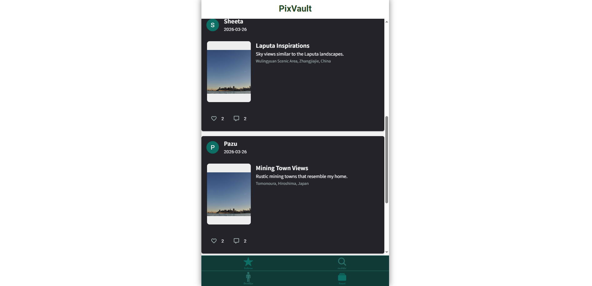
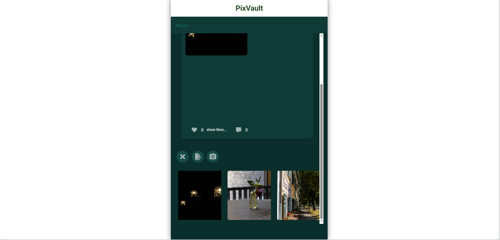
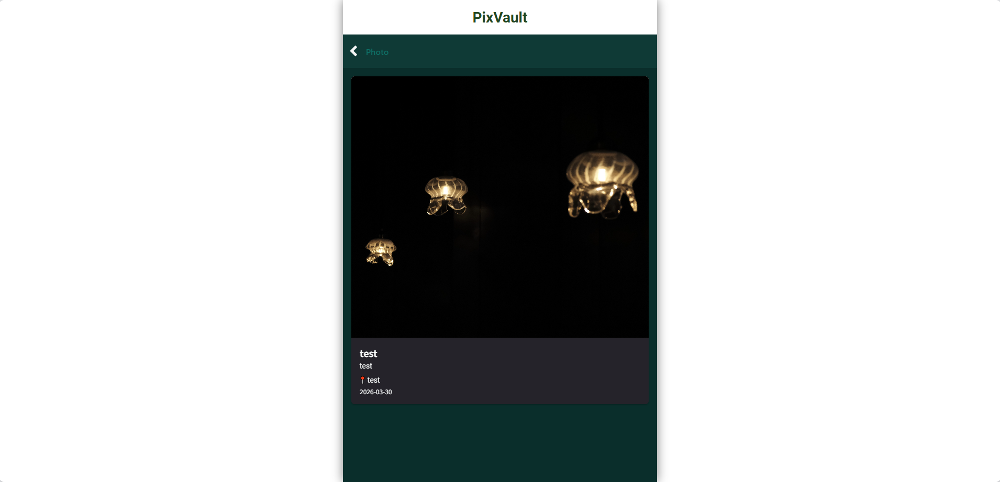
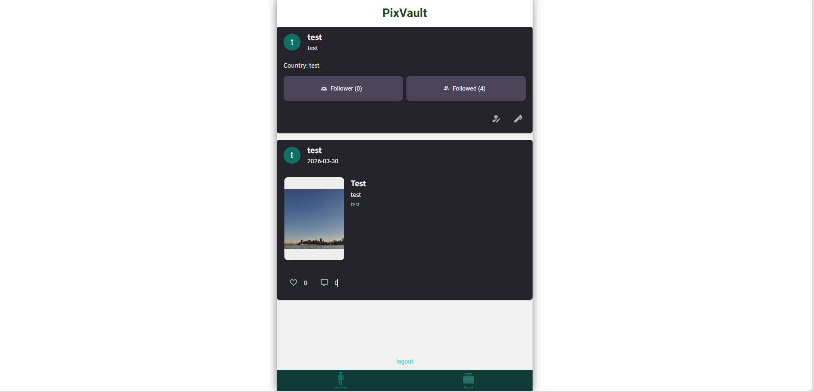
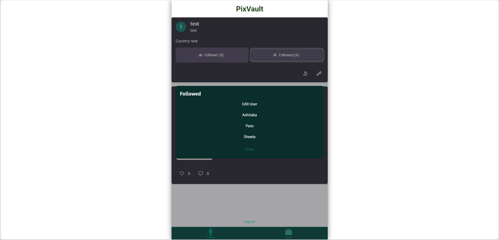
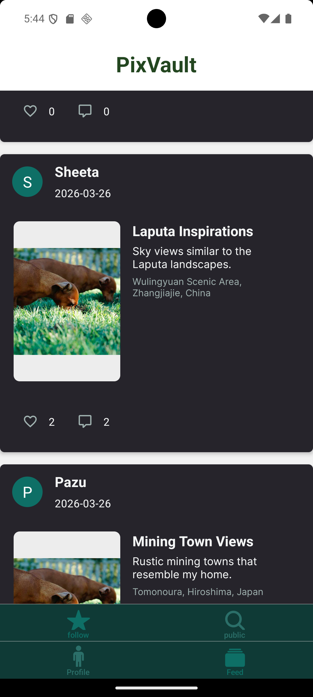
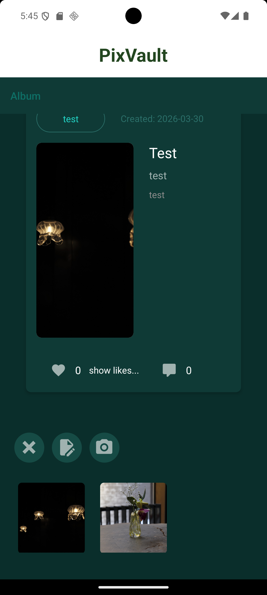

# PixVault

## Overview

**PixVault** is a full-stack photo-sharing application with a strong focus on
**database-centered design and relational data integrity**.

The application allows users to create albums, upload photos, and interact through likes, comments, and follows.
Images are securely handled via **Cloudinary**, while all metadata and relationships are managed using **PostgreSQL**.

This project was designed to demonstrate practical skills in:

- Relational database modeling
- Backend validation and authentication
- Full-stack application architecture

PixVault also includes a **mobile client built with Expo (React Native)**,
sharing the same backend and database as the web version.

---

## Demo / Screenshots

> 📸 Screenshots from the deployed application

**Feed**



**Album View & Photos**



**User Profile**



**Mobile Preview (Expo / Android Emulator)**  



---

## Database-Centered Design

### ER Diagram

**Title:** `Database Schema for PixVault`

**Description:**
This ER diagram represents the relational database design of **PixVault**.
It visualizes how users, albums, photos, comments, likes, follows, visibilities, and sessions are connected.

The schema is designed to ensure:

- Strong data integrity
- Clear ownership of user-generated content
- Scalability for social features

**Diagram (click to view full version on DrawSQL):**
[](https://drawsql.app/teams/nagisa/diagrams/database-schema-for-photosns)

---

## Core Database Tables

### users

| Column              | Type        | Constraints                               |
| ------------------- | ----------- | ----------------------------------------- |
| id                  | integer     | PRIMARY KEY, GENERATED ALWAYS AS IDENTITY |
| name                | varchar(30) | NOT NULL                                  |
| birthday            | date        | NOT NULL                                  |
| country             | varchar(30) | NOT NULL                                  |
| account_description | text        | NULL                                      |
| email               | varchar(50) | NOT NULL, UNIQUE                          |
| password_hash       | text        | NOT NULL                                  |
| created_date        | timestamp   | DEFAULT now()                             |

---

### albums

| Column        | Type        | Constraints                            |
| ------------- | ----------- | -------------------------------------- |
| id            | integer     | PRIMARY KEY                            |
| user_id       | integer     | REFERENCES users(id) ON DELETE CASCADE |
| title         | varchar(30) | NOT NULL                               |
| description   | text        | NULL                                   |
| location      | text        | NULL                                   |
| created_date  | timestamp   | DEFAULT now()                          |
| visibility_id | integer     | REFERENCES visibilities(id)            |

---

### photos

| Column               | Type        | Constraints                             |
| -------------------- | ----------- | --------------------------------------- |
| id                   | integer     | PRIMARY KEY                             |
| album_id             | integer     | REFERENCES albums(id) ON DELETE CASCADE |
| title                | varchar(30) | NULL                                    |
| cloudinary_data_path | text        | NOT NULL                                |
| description          | text        | NULL                                    |
| location             | text        | NULL                                    |
| created_date         | timestamp   | DEFAULT now()                           |

---

### Social Interaction Tables

- **comments** – user comments on albums
- **likes** – user likes on albums
- **follows** – user-to-user following relationships

All relations use **foreign keys with ON DELETE CASCADE** to prevent orphaned data.

---

### Supporting Tables

- **visibilities** – controls album visibility (e.g. public/private)
- **sessions** – token-based authentication with expiry timestamps

---

## Tech Stack

| Layer          | Technology                                               |
| -------------- | -------------------------------------------------------- |
| Frontend       | React 18, Expo Router, React Native Paper (Web & Mobile) |
| Backend        | Node.js, TypeScript, Ley                                 |
| Database       | PostgreSQL (`postgres` driver)                           |
| Validation     | Zod (server-side schemas)                                |
| Authentication | Custom auth with bcryptjs + sessions                     |
| Image Storage  | Cloudinary                                               |
| Testing        | Jest, jest-expo                                          |
| Tooling        | ESLint, Prettier, tsx                                    |
| Deployment     | Vercel                                                   |

---

## Mobile App (Expo Preview Build)

PixVault includes a mobile application built with **Expo (React Native)**.
The mobile app uses the **same backend API and PostgreSQL database**
as the web version, deployed on Vercel with Neon.

### Expo Preview Build

A preview build is available for testing the mobile app in a production-like environment.

**📥 Download & Install:**
[Download PixVault Android APK (Preview)](https://expo.dev/accounts/frosch79/projects/final-project-winter-2025-eu-nagisa-riegler/builds/8517fe26-a53d-4844-a82a-4fa804034f0b)

**How to install:**

1. Download the APK file on your Android device.
2. Open the file and allow "Install from unknown sources" if prompted.

**Key points:**

- Uses production backend (Vercel API + Neon database)
- No local Metro server required
- Intended for testing and portfolio demonstration
- Not published to Google Play Store

### Requirements

- Android Emulator or physical Android device
- Expo / EAS CLI (optional, for local builds)

### Environment Variables (Mobile)

The mobile app requires a public API base URL:

````env


Notes

Preview builds behave like production builds

Authentication and database access require a running backend

If the backend or database is unavailable, the app may stop at the auth check screen


### Mobile (Optional)

To run the mobile app locally:

```bash
npx expo start
For production-like testing, an Expo preview build is recommended instead of local development.
---

## Key Features

- User registration and login
- Album creation with visibility control
- Photo uploads using Cloudinary
- Likes, comments, and follow system
- Secure server-side validation with Zod
- Relational queries combining multiple tables
- Deployed and runnable production build

---

## Sample Data

- Pre-seeded photo data using Cloudinary demo images
- Demonstrates real database usage and relational queries
- Enables immediate preview of albums and feeds

---

## Local Setup

```bash
git clone https://github.com/Frosch79/final-project-winter-2025-eu-nagisa-riegler
cd pixvault
pnpm install
````

### Environment Variables

Create a `.env` file based on the following required variables:

#### Database (PostgreSQL / Neon)

```env
PGHOST=xxxxxxxxxxxx
PGDATABASE=xxxxxxxxxxxx
PGUSERNAME=xxxxxxxxxxxx
PGPASSWORD=xxxxxxxxxxxx

```

#### Image Storage (Cloudinary)

```env
CLOUDINARY_API_KEY=your_key
CLOUDINARY_API_SECRET=your_secret
CLOUDINARY_CLOUD_NAME=your_cloud

```

#### API Configuration

```env
# For Web
NEXT_PUBLIC_API_URL=http://localhost:3000

# For Mobile (Use your local IP address for physical devices)
EXPO_PUBLIC_API_URL=http://192.168.x.x:3000

```

### Run Migrations

```bash
pnpm migrate
```

### Start Development Server

```bash
pnpm start
```

```md
## | Deployment | Vercel (Web & API), Expo EAS (Mobile Preview) |

## Future Improvements

- Real-time features via WebSocket (live comments, likes, notifications)
- Analytics and reporting APIs (engagement, popular albums)
- Enhanced security (UUID-based primary keys)
- Performance optimization for large feeds

---

## Why PixVault?

- **Database-first design** with clear relational modeling
- Strong emphasis on data integrity and cascading rules
- Real-world backend validation and authentication
- Cloud-based image handling
- Visual documentation via ER diagrams
- Production-ready structure suitable for extension

---

### Final Note

PixVault was built as a portfolio project to demonstrate
**practical full-stack development with a strong backend and database focus**.
```
